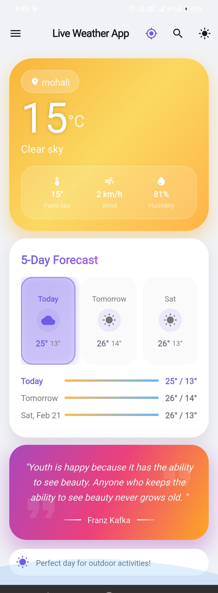
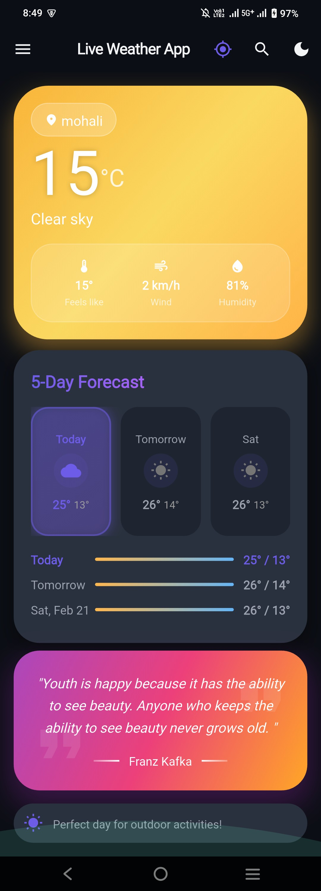
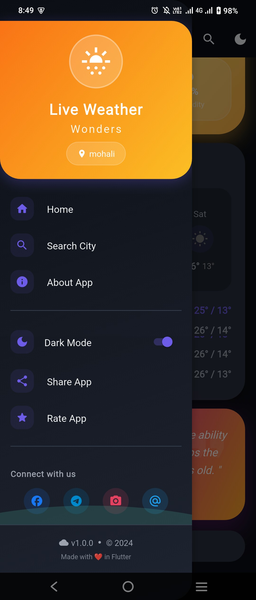
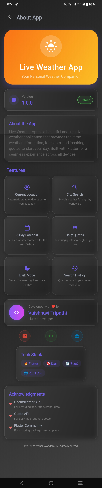
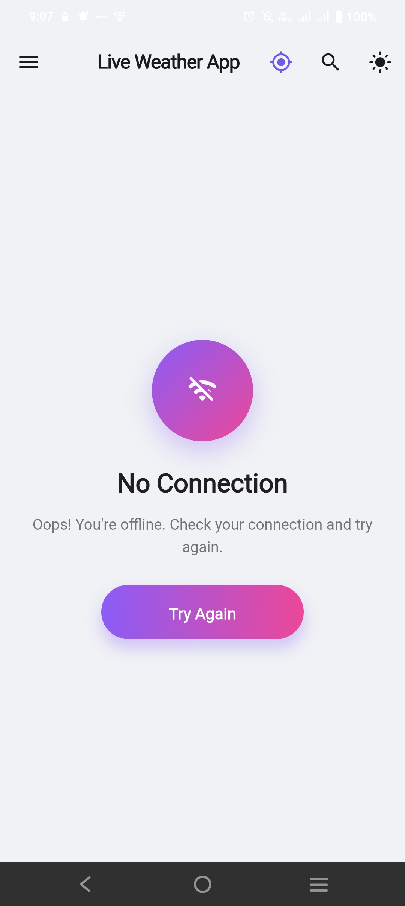
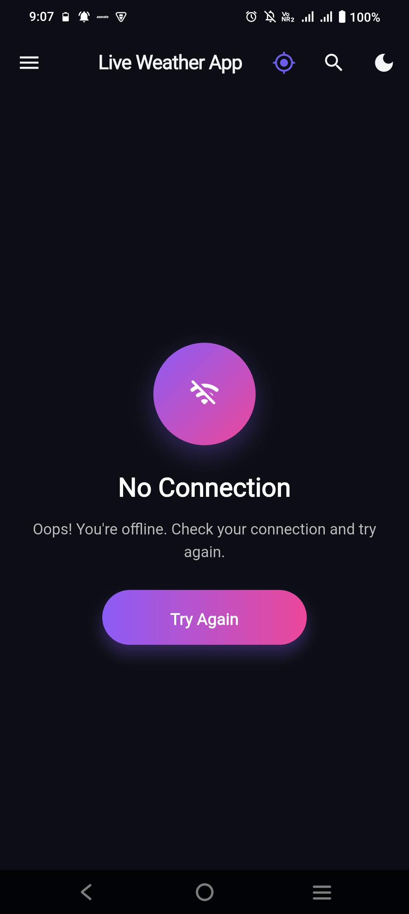

# 🌤️ Live Weather App

A beautiful Flutter weather application that provides real-time weather updates with a stunning glassmorphism UI design.

## 📱 Features

- 🌍 **Real-time Weather** - Get current weather conditions for any city
- 🔍 **City Search** - Search and save your favorite cities
- 🌙 **Dark/Light Mode** - Toggle between dark and light themes
- 💬 **Daily Quotes** - Inspirational quotes with weather-based backgrounds
- 📍 **Location-based Weather** - Auto-detect weather for your current location
- 📱 **Responsive Design** - Works perfectly on all screen sizes
- 🎨 **Glassmorphism UI** - Beautiful modern design with blur effects

## 📸 Screenshots

<div align="center">
  
  
  
</div>

<div align="center">
  
  
  
</div>

<div align="center">
  
  
</div>

## 🚀 Tech Stack

- **Flutter** - UI framework
- **Dart** - Programming language
- **BLoC/Cubit** - State management
- **Provider** - State management for specific features
- **Weather API** - Real-time weather data
- **SharedPreferences** - Local data storage
- **Connectivity Plus** - Network connectivity check
- **Geolocator** - Device location services

## 📦 Installation

1. **Clone the repository**
   ```bash
   git clone https://github.com/Vaishnavitripathi1003/live_weather_app.git
   ```

2. **Navigate to project directory**
   ```bash
   cd live_weather_app
   ```

3. **Install dependencies**
   ```bash
   flutter pub get
   ```

4. **Get API Key**
    - Sign up at [OpenWeatherMap](https://openweathermap.org/api)
    - Get your free API key
    - Add it to the project (instructions in code comments)

5. **Run the app**
   ```bash
   flutter run
   ```

## 🏗️ Project Structure

```
lib/
├── core/
│   ├── constants/
│   ├── themes/
│   └── utils/
├── data/
│   ├── models/
│   ├── repositories/
│   └── services/
├── presentation/
│   ├── bloc/
│   │   ├── theme/
│   │   └── weather/
│   ├── providers/
│   ├── screens/
│   └── widgets/
└── main.dart
```

## 🎯 Key Features Explained

### Weather Updates
- Real-time temperature, humidity, wind speed
- 5-day weather forecast
- Weather conditions with icons

### Search Functionality
- Search any city worldwide
- Auto-suggestions while typing
- Save favorite locations

### Theme Support
- Seamless dark/light mode switching
- Persistent theme preference
- Beautiful glassmorphism effects

## 📱 How to Use

1. **Open the app** - Splash screen appears
2. **Allow location** - For current location weather (optional)
3. **Search cities** - Use search icon to find any city
4. **View weather** - See detailed weather information
5. **Toggle theme** - Use drawer to switch dark/light mode
6. **Share app** - Rate and share with friends

## 🤝 Contributing

Contributions are welcome! Please feel free to submit a Pull Request.

1. Fork the project
2. Create your feature branch (`git checkout -b feature/AmazingFeature`)
3. Commit your changes (`git commit -m 'Add some AmazingFeature'`)
4. Push to the branch (`git push origin feature/AmazingFeature`)
5. Open a Pull Request

## 📝 License

This project is licensed under the MIT License - see the [LICENSE](LICENSE) file for details.

## 📧 Contact

**Vaishnavi Tripathi**

- GitHub: [@Vaishnavitripathi1003](https://github.com/Vaishnavitripathi1003)
- Project Link: [https://github.com/Vaishnavitripathi1003/live_weather_app](https://github.com/Vaishnavitripathi1003/live_weather_app)

## 🙏 Acknowledgments

- [OpenWeatherMap API](https://openweathermap.org/api) for weather data
- [Flutter](https://flutter.dev) for the amazing framework
- All contributors and supporters

---

<div align="center">
  Made with ❤️ by Vaishnavi Tripathi
</div>